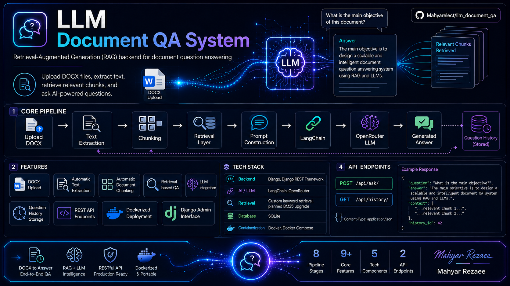

# LLM Document QA System


<p align="center">
  
</p>

## System Architecture

The system follows a Retrieval-Augmented Generation (RAG) pipeline:

1. User uploads DOCX document
2. Text extraction is performed
3. Document is chunked
4. Retrieval layer finds relevant chunks
5. Prompt is constructed
6. LangChain sends request to OpenRouter LLM
7. Generated answer is returned
8. Question history is stored


A Retrieval-Augmented Generation (RAG) backend system built with Django, Django REST Framework, LangChain, and OpenRouter.

The system allows users to upload DOCX documents, extract text, retrieve relevant document chunks, and ask AI-powered questions about uploaded content.

---

# Features

- Upload DOCX documents
- Automatic text extraction
- Automatic document chunking
- Retrieval-based question answering
- LLM integration using OpenRouter
- Question history storage
- REST API endpoints
- Dockerized deployment
- Django Admin interface

---

# Tech Stack

## Backend

- Django
- Django REST Framework

## AI / LLM

- LangChain
- OpenRouter

## Retrieval

- Custom keyword-based retrieval
- Planned BM25 upgrade

## Database

- SQLite

## Containerization

- Docker
- Docker Compose

---

# Project Architecture

```text
User
  ↓
Django REST API
  ↓
Retrieval Layer
  ↓
Prompt Construction
  ↓
LangChain
  ↓
OpenRouter LLM
  ↓
Generated Answer
```

---

## BM25 Information Retrieval (IR) Search

The project includes an advanced retrieval method using **BM25**, a classical Information Retrieval ranking algorithm, to find the most relevant chunks of text from uploaded documents.

### How it works

1. **Text Tokenization:** Each document chunk is tokenized into lowercase words.
2. **BM25 Indexing:** All tokenized chunks are used to build a BM25 index.
3. **Query Tokenization:** User questions are tokenized using the same method.
4. **Scoring:** BM25 scores each chunk based on relevance to the tokenized query.
5. **Top Chunks:** The top N chunks (default 3) are selected and passed as context to the LLM.

### Features

- **Optional Search Method:** Users can select BM25 as an alternative to the default simple keyword search.
- **Top-N Retrieval:** Configurable number of chunks to return.
- **Context Construction:** Retrieved chunks are concatenated to create the context for LLM prompts.
- **Fallback:** If no relevant chunks are found, the system returns `"I could not find relevant information in the uploaded documents."`

### Example Usage in API

```json
POST /api/ask/
{
  "question": "What programming languages does Mahyar know?",
  "search_method": "bm25"
}
```


# Installation

## Clone Repository

```bash
git clone https://github.com/Mahyarelect/llm_document_qa.git
cd llm_document_qa
```

## Create Virtual Environment

```bash
python -m venv venv
```

## Activate Virtual Environment

### Windows

```bash
venv\Scripts\activate
```

### Linux / Mac

```bash
source venv/bin/activate
```

## Install Dependencies

```bash
pip install -r requirements.txt
```

---

# Environment Variables

Create `.env`

```env
OPENROUTER_API_KEY=your_api_key
OPENROUTER_MODEL=openrouter/free
```

---

# Run Migrations

```bash
python manage.py makemigrations
python manage.py migrate
```

---

# Create Superuser

```bash
python manage.py createsuperuser
```

---

# Run Development Server

```bash
python manage.py runserver
```

Server URL:

```text
http://127.0.0.1:8000/
```

---

# Docker Setup

## Build Docker Image

```bash
docker compose build --no-cache
```

## Run Container

```bash
docker compose up
```

## Run Migrations Inside Docker

```bash
docker compose exec web python manage.py migrate
```

## Create Superuser Inside Docker

```bash
docker compose exec web python manage.py createsuperuser
```

---

# API Endpoints

## Ask Question

```text
POST /api/ask/
```

### Request

```json
{
  "question": "What programming languages does Mahyar know?"
}
```

### Response

```json
{
  "question": "What programming languages does Mahyar know?",
  "answer": "Java, Python, C, SQL",
  "context": "...",
  "history_id": 1
}
```

---

## Question History

```text
GET /api/history/
```

---

# Retrieval Pipeline

1. User submits question
2. Question is tokenized
3. Relevant chunks are scored
4. Top chunks selected
5. Prompt generated
6. LLM produces answer
7. History stored

---

# Current Limitations

- DOCX only
- SQLite only
- Basic keyword retrieval
- No embeddings
- No vector database
- No frontend
- No authentication

---

# Future Improvements

- ChromaDB / FAISS
- PostgreSQL
- PDF support
- React frontend
- JWT authentication

---

# Security Notes

Never upload:

- `.env`
- API keys
- `venv/`
- `db.sqlite3`

---

# Author

Mahyar Rezaeepoor

GitHub:

```text
https://github.com/Mahyarelect
```